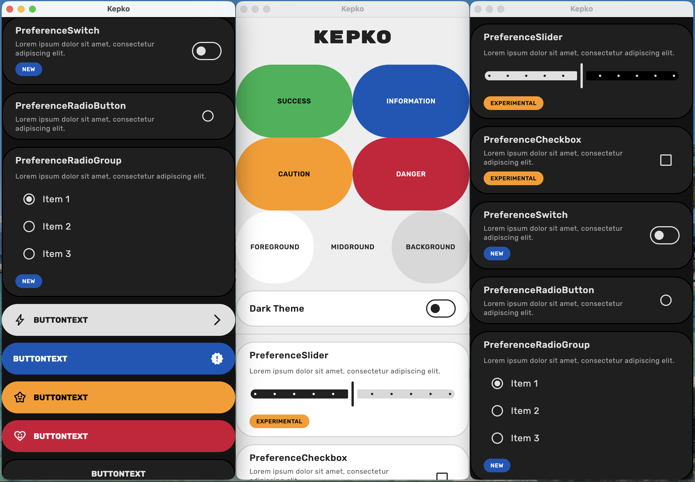

<p align="center">
  
</p>

<p align="center">
  <a href="https://central.sonatype.com/artifact/glass.yasan.kepko/core"></a>
  <a href="LICENSE"></a>
  <a href="https://kotlinlang.org"></a>
  <a href="https://github.com/yasanglass/kepko/actions/workflows/android.yml"></a>
  <a href="https://github.com/yasanglass/kepko/actions/workflows/jvm.yml"></a>
  <a href="https://github.com/yasanglass/kepko/actions/workflows/ios.yml"></a>
  <a href="https://github.com/yasanglass/kepko/actions/workflows/js.yml"></a>
  <a href="https://github.com/yasanglass/kepko/actions/workflows/wasm.yml"></a>
  <a href="https://github.com/yasanglass/kepko/actions/workflows/detekt.yml"></a>
  <a href="https://github.com/yasanglass/kepko/actions/workflows/snapshots.yml"></a>
  <a href="https://github.com/yasanglass/kepko/actions/workflows/publish.yml"></a>
</p>

A work-in-progress design system for Compose Multiplatform.

## Usage

This library is published on [Maven Central](https://central.sonatype.com/namespace/glass.yasan.kepko):

```kotlin
implementation("glass.yasan.kepko:foundation:<version>")
implementation("glass.yasan.kepko:component:<version>")
```

Wrap your app content with `KepkoTheme`:

```kotlin
import glass.yasan.kepko.component.Text
import glass.yasan.kepko.foundation.theme.KepkoTheme

KepkoTheme {
    Text("Hello, Kepko!")
}
```

## Components

### Primitives
  - [Button](compose-multiplatform/component/src/commonMain/kotlin/glass/yasan/kepko/component/Button.kt)
  - [ButtonText](compose-multiplatform/component/src/commonMain/kotlin/glass/yasan/kepko/component/ButtonText.kt)
  - [Checkbox](compose-multiplatform/component/src/commonMain/kotlin/glass/yasan/kepko/component/Checkbox.kt)
  - [CircularProgressIndicator](compose-multiplatform/component/src/commonMain/kotlin/glass/yasan/kepko/component/ProgressIndicator.kt)
  - [HorizontalDivider](compose-multiplatform/component/src/commonMain/kotlin/glass/yasan/kepko/component/HorizontalDivider.kt)
  - [Icon](compose-multiplatform/component/src/commonMain/kotlin/glass/yasan/kepko/component/Icon.kt)
  - [LinearProgressIndicator](compose-multiplatform/component/src/commonMain/kotlin/glass/yasan/kepko/component/ProgressIndicator.kt)
  - [RadioButton](compose-multiplatform/component/src/commonMain/kotlin/glass/yasan/kepko/component/RadioButton.kt)
  - [Slider](compose-multiplatform/component/src/commonMain/kotlin/glass/yasan/kepko/component/Slider.kt)
  - [Surface](compose-multiplatform/component/src/commonMain/kotlin/glass/yasan/kepko/component/Surface.kt)
  - [Switch](compose-multiplatform/component/src/commonMain/kotlin/glass/yasan/kepko/component/Switch.kt)
  - [Text](compose-multiplatform/component/src/commonMain/kotlin/glass/yasan/kepko/component/Text.kt)
  - [TextMono](compose-multiplatform/component/src/commonMain/kotlin/glass/yasan/kepko/component/TextMono.kt)
  - [TextPill](compose-multiplatform/component/src/commonMain/kotlin/glass/yasan/kepko/component/TextPill.kt)
  - [VerticalDivider](compose-multiplatform/component/src/commonMain/kotlin/glass/yasan/kepko/component/VerticalDivider.kt)

### Preferences
  - [PreferenceAppIdentity](compose-multiplatform/component/src/commonMain/kotlin/glass/yasan/kepko/component/PreferenceAppIdentity.kt)
  - [PreferenceCheckbox](compose-multiplatform/component/src/commonMain/kotlin/glass/yasan/kepko/component/PreferenceCheckbox.kt)
  - [PreferenceContainer](compose-multiplatform/component/src/commonMain/kotlin/glass/yasan/kepko/component/PreferenceContainer.kt)
  - [PreferenceRadioButton](compose-multiplatform/component/src/commonMain/kotlin/glass/yasan/kepko/component/PreferenceRadioButton.kt)
  - [PreferenceRadioGroup](compose-multiplatform/component/src/commonMain/kotlin/glass/yasan/kepko/component/PreferenceRadioGroup.kt)
  - [PreferenceSlider](compose-multiplatform/component/src/commonMain/kotlin/glass/yasan/kepko/component/PreferenceSlider.kt)
  - [PreferenceSwitch](compose-multiplatform/component/src/commonMain/kotlin/glass/yasan/kepko/component/PreferenceSwitch.kt)

## Sample

A simple sample app is included so you can explore Kepko in a real project: [compose-multiplatform/sample](compose-multiplatform/sample).


