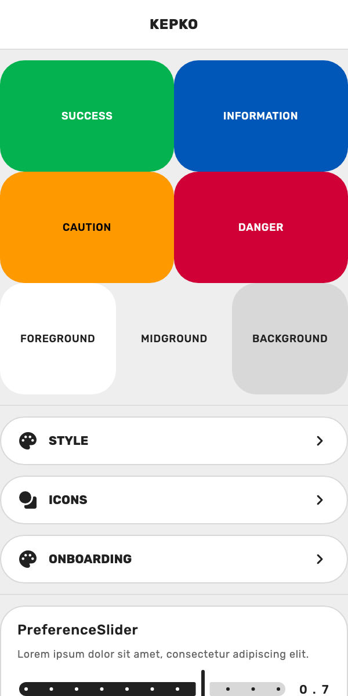
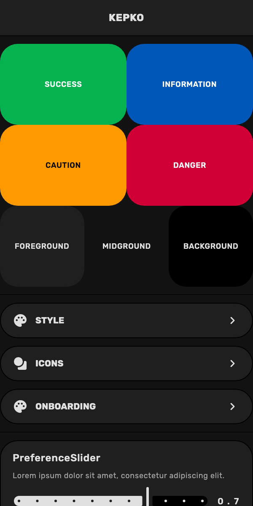

<p align="center">
  
</p>

<p align="center">
  <a href="https://central.sonatype.com/artifact/glass.yasan.kepko/foundation"></a>
  <a href="https://github.com/yasanglass/kepko/blob/main/LICENSE"></a>
  <a href="https://crowdin.com/project/kepko"></a>
  <a href="https://codecov.io/gh/yasanglass/kepko"></a>
  <a href="https://context7.com/yasanglass/kepko/llms.txt"></a>
  <a href="https://yasanglass.github.io/kepko/"></a>
</p>

An opinionated design system for Compose Multiplatform.

## Installation

Published on [Maven Central](https://central.sonatype.com/namespace/glass.yasan.kepko):

```kotlin
implementation("glass.yasan.kepko:component:<version>")
implementation("glass.yasan.kepko:foundation:<version>")
```

## Usage

Wrap your app content with [`KepkoTheme`](https://github.com/yasanglass/kepko/blob/main/foundation/src/commonMain/kotlin/glass/yasan/kepko/foundation/theme/Theme.kt):

| Code | Preview |
|---|---|
| <pre lang="kotlin">KepkoTheme {&#10;    Text("Hello, Kepko!")&#10;    TextPill(&#10;        text = "Yasan Glass",&#10;        containerColor = KepkoTheme.colors.information,&#10;    )&#10;}</pre> |  |

## Components

| Component | Light | Dark |
|---|---|---|
| [ButtonText](https://github.com/yasanglass/kepko/blob/main/component/src/commonMain/kotlin/glass/yasan/kepko/component/ButtonText.kt) |  |  |
| [OutlinedTextField](https://github.com/yasanglass/kepko/blob/main/component/src/commonMain/kotlin/glass/yasan/kepko/component/OutlinedTextField.kt) |  |  |
| [PreferenceCheckbox](https://github.com/yasanglass/kepko/blob/main/component/src/commonMain/kotlin/glass/yasan/kepko/component/PreferenceCheckbox.kt) |  |  |
| [PreferenceRadioButton](https://github.com/yasanglass/kepko/blob/main/component/src/commonMain/kotlin/glass/yasan/kepko/component/PreferenceRadioButton.kt) |  |  |
| [PreferenceRadioGroup](https://github.com/yasanglass/kepko/blob/main/component/src/commonMain/kotlin/glass/yasan/kepko/component/PreferenceRadioGroup.kt) |  |  |
| [PreferenceSlider](https://github.com/yasanglass/kepko/blob/main/component/src/commonMain/kotlin/glass/yasan/kepko/component/PreferenceSlider.kt) |  |  |
| [PreferenceSwitch](https://github.com/yasanglass/kepko/blob/main/component/src/commonMain/kotlin/glass/yasan/kepko/component/PreferenceSwitch.kt) |  |  |

See the full list of components [here](https://github.com/yasanglass/kepko/tree/main/component/src/commonMain/kotlin/glass/yasan/kepko/component).

## Theme Styles

| Theme Style | Preview |
|---|---|
| [Light](https://github.com/yasanglass/kepko/blob/main/foundation/src/commonMain/kotlin/glass/yasan/kepko/foundation/theme/ThemeStyle.kt) |  |
| [Dark](https://github.com/yasanglass/kepko/blob/main/foundation/src/commonMain/kotlin/glass/yasan/kepko/foundation/theme/ThemeStyle.kt) |  |
| [Black (AMOLED)](https://github.com/yasanglass/kepko/blob/main/foundation/src/commonMain/kotlin/glass/yasan/kepko/foundation/theme/ThemeStyle.kt) |  |
| [Solarized Light](https://github.com/yasanglass/kepko/blob/main/foundation/src/commonMain/kotlin/glass/yasan/kepko/foundation/theme/ThemeStyle.kt) |  |
| [Solarized Dark](https://github.com/yasanglass/kepko/blob/main/foundation/src/commonMain/kotlin/glass/yasan/kepko/foundation/theme/ThemeStyle.kt) |  |

## Persistence

An optional module that automatically persists and restores theme preferences across the app launches.

```kotlin
implementation("glass.yasan.kepko:persistence:<version>")
```

Use [`PersistentKepkoTheme`](https://github.com/yasanglass/kepko/blob/main/persistence/src/commonMain/kotlin/glass/yasan/kepko/persistence/PersistentKepkoTheme.kt) instead of `KepkoTheme` to automatically persist and restore theme preferences:

```kotlin
@OptIn(ExperimentalKepkoApi::class)
PersistentKepkoTheme {
    // your app content
}
```

To let users change the persisted theme setting, use [`PersistentPreferenceThemeScreen`](https://github.com/yasanglass/kepko/blob/main/persistence/src/commonMain/kotlin/glass/yasan/kepko/persistence/PersistentPreferenceThemeScreen.kt):

```kotlin
PersistentPreferenceThemeScreen(
    onBackClick = { /* navigate back */ },
)
```

[`PersistentKepkoTheme`](https://github.com/yasanglass/kepko/blob/main/persistence/src/commonMain/kotlin/glass/yasan/kepko/persistence/PersistentKepkoTheme.kt) provides the following [`CompositionLocal`](https://developer.android.com/reference/kotlin/androidx/compose/runtime/CompositionLocal) values inside its content:

- [`LocalKepkoThemeStyle`](https://github.com/yasanglass/kepko/blob/main/persistence/src/commonMain/kotlin/glass/yasan/kepko/persistence/PersistenceManager.kt): the currently active [`ThemeStyle`](https://github.com/yasanglass/kepko/blob/main/foundation/src/commonMain/kotlin/glass/yasan/kepko/foundation/theme/ThemeStyle.kt)
- [`LocalKepkoPersistenceManager`](https://github.com/yasanglass/kepko/blob/main/persistence/src/commonMain/kotlin/glass/yasan/kepko/persistence/PersistenceManager.kt): the [`PersistenceManager`](https://github.com/yasanglass/kepko/blob/main/persistence/src/commonMain/kotlin/glass/yasan/kepko/persistence/PersistenceManager.kt) instance for direct access to persistence state

## Sample Project

Explore Kepko in a real project with the included [sample project](https://github.com/yasanglass/kepko/tree/main/sample).

 | 
---|---
