<p align="center">
  
</p>

<p align="center">
  <a href="https://central.sonatype.com/artifact/glass.yasan.kepko/foundation"></a>
  <a href="LICENSE"></a>
  <a href="https://crowdin.com/project/kepko"></a>
  <a href="https://codecov.io/gh/yasanglass/kepko"></a>
  <a href="https://context7.com/yasanglass/kepko/llms.txt"></a>
  <a href="https://yasanglass.github.io/kepko/"></a>
</p>

An opinionated design system for Compose Multiplatform.

## Installation

Published on [Maven Central](https://central.sonatype.com/namespace/glass.yasan.kepko):

```kotlin
implementation("glass.yasan.kepko:component:<version>")
implementation("glass.yasan.kepko:foundation:<version>")
```

## Usage

Wrap your app content with `KepkoTheme`:

| Code | Preview |
|---|---|
| <pre lang="kotlin">KepkoTheme {&#10;    Text("Hello, Kepko!")&#10;    TextPill(&#10;        text = "Yasan Glass",&#10;        containerColor = KepkoTheme.colors.information,&#10;    )&#10;}</pre> | 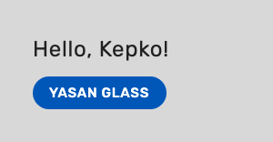 |

## Components

| Component | Light | Dark |
|---|---|---|
| [ButtonText](component/src/commonMain/kotlin/glass/yasan/kepko/component/ButtonText.kt) | 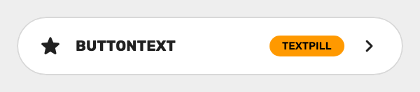 | 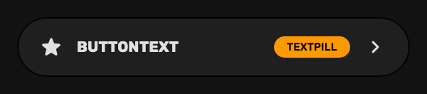 |
| [OutlinedTextField](component/src/commonMain/kotlin/glass/yasan/kepko/component/OutlinedTextField.kt) | 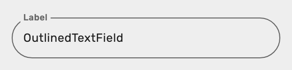 | 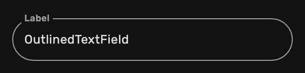 |
| [PreferenceCheckbox](component/src/commonMain/kotlin/glass/yasan/kepko/component/PreferenceCheckbox.kt) | 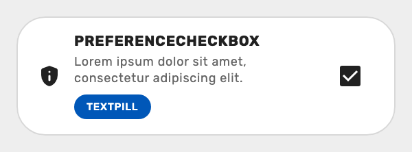 | 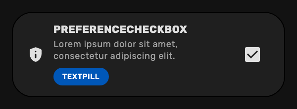 |
| [PreferenceRadioButton](component/src/commonMain/kotlin/glass/yasan/kepko/component/PreferenceRadioButton.kt) | 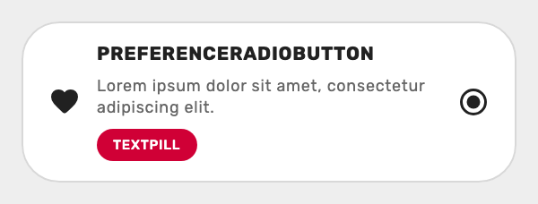 | 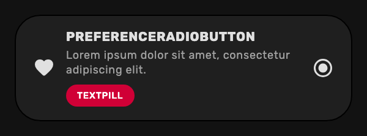 |
| [PreferenceRadioGroup](component/src/commonMain/kotlin/glass/yasan/kepko/component/PreferenceRadioGroup.kt) | 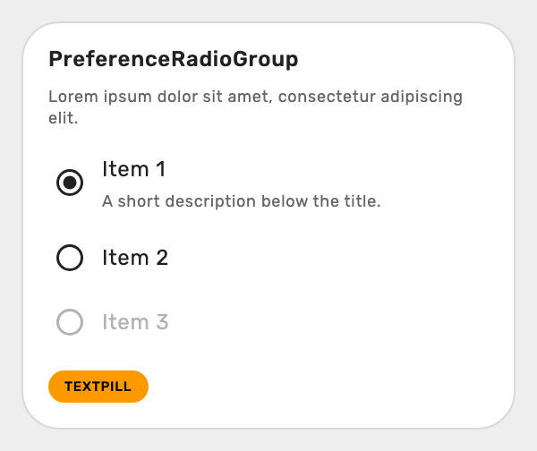 | 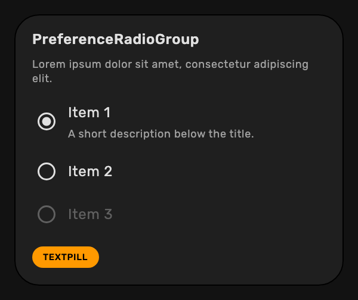 |
| [PreferenceSlider](component/src/commonMain/kotlin/glass/yasan/kepko/component/PreferenceSlider.kt) | 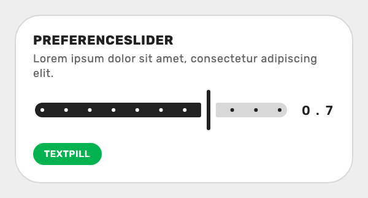 | 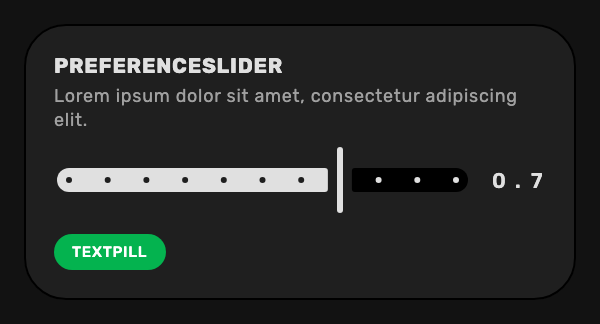 |
| [PreferenceSwitch](component/src/commonMain/kotlin/glass/yasan/kepko/component/PreferenceSwitch.kt) | 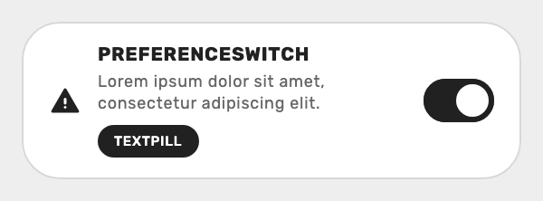 | 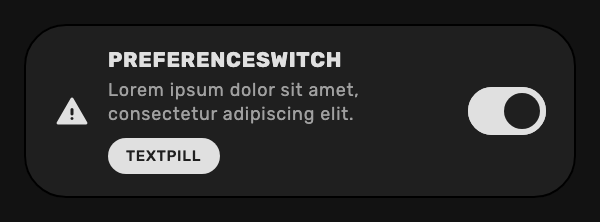 |

See the full list of components [here](component/src/commonMain/kotlin/glass/yasan/kepko/component).

## Sample Project

Explore Kepko in a real project with the included [sample project](sample).

 | 
---|---
